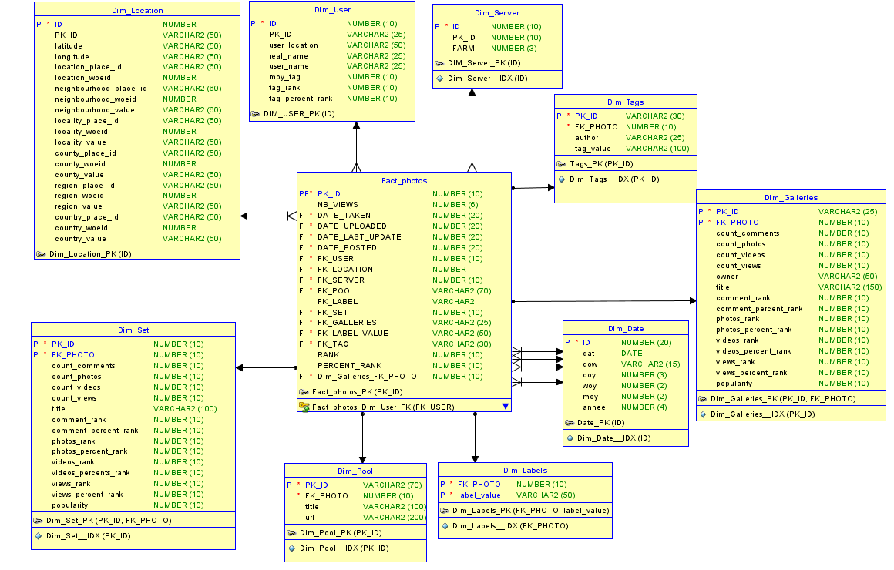

Business Intelligence
=============
### Description ###
Réalisation d'un datawarehouse à l'aide d'un jeu de données public (des photos) mis à disposition par Flickr.
Implémentation à l'aide de la pile de logiciels Oracle. Oracle 12c pour la base de données. Réalisation d'un reporting.

Lien de téléchargement des sources [ici](https://snap.stanford.edu/data/flickrXml.tar.gz)

### Modèle Conceptuel de données du datawarehouse ###

Développé dans le cadre de l'UV [MTI820](https://cours.etsmtl.ca/mti820/) (Entrepôts de données et intelligence d'affaires) à l'ETS de Montréal.